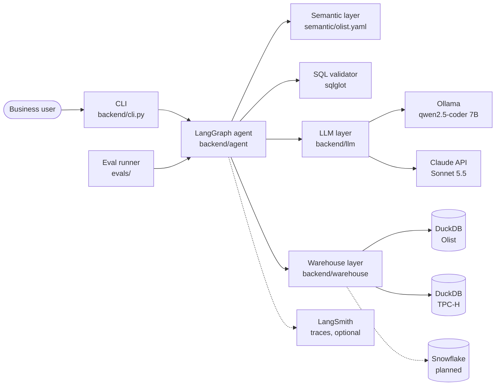
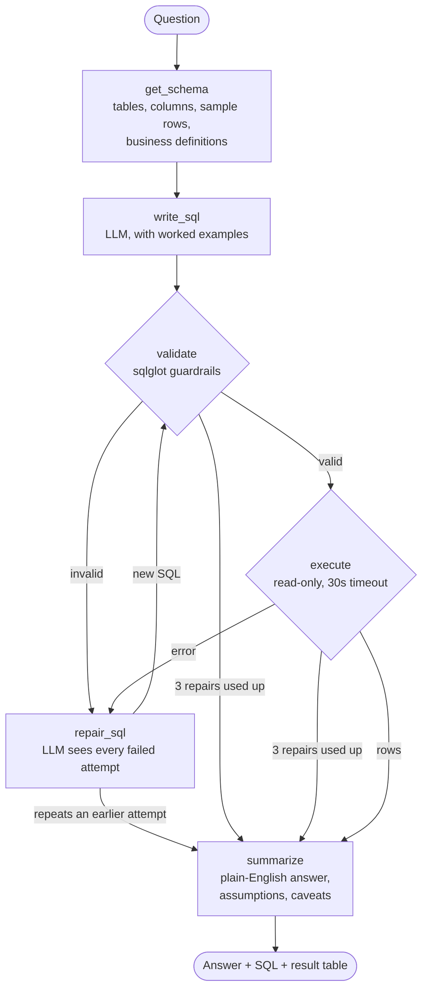

# QueryPilot: Agentic Text-to-SQL Analytics

Ask a business question in plain English. QueryPilot finds the right tables,
writes SQL, checks it against seven guardrails, runs it read-only, repairs its
own errors, and explains the answer, always showing the SQL it ran.

<!-- Demo GIF goes here once the web UI (Phase 3) is built. -->

A real run on the local model (first question of the session, so the model
had not cached the schema yet):

```text
$ DATASET=olist python -m backend.cli "Which 5 customer states generated the most revenue?"
Question: Which 5 customer states generated the most revenue?
Model:    ollama:qwen2.5-coder:7b

[  0.1s] get_schema 8 tables
[ 61.1s] write_sql  ok
[ 61.2s] validate   ok
[ 61.3s] execute    5 rows
[ 73.5s] summarize  ok

SQL:
SELECT
  c.customer_state,
  SUM(oi.price) AS total_revenue
FROM customers AS c
JOIN orders AS o
  ON c.customer_id = o.customer_id
JOIN order_items AS oi
  ON o.order_id = oi.order_id
GROUP BY
  c.customer_state
ORDER BY
  total_revenue DESC
LIMIT 5

Result:
customer_state | total_revenue
---------------+--------------
SP             | 5,202,955.05
RJ             | 1,824,092.67
MG             | 1,585,308.03
RS             | 750,304.02
PR             | 683,083.76

Answer:
The top 5 customer states by revenue are SP, RJ, MG, RS, and PR, generating
$5,202,955.05, $1,824,092.67, $1,585,308.03, $750,304.02, and $683,083.76
respectively. Revenue was calculated as the sum of prices in the order items.
```

> **Status:** the agent, guardrails, semantic layer, and evals work in the
> terminal on local DuckDB data. Web UI, Snowflake, and deployment are next.

## Results

Execution accuracy on 40 hand-written questions about a real e-commerce
dataset ([Olist](https://www.kaggle.com/datasets/olistbr/brazilian-ecommerce)),
before and after adding the semantic layer and the other fixes.

| | qwen2.5-coder 7B (local) before | qwen2.5-coder 7B (local) after | Claude Sonnet 5.5 before | Claude Sonnet 5.5 after |
|---|---|---|---|---|
| **Accuracy** | 14/40 (35%) | **29/40 (72%)** | 35/40 (88%) | **40/40 (100%)** |
| Easy (12) | 10 | 12 | 12 | 12 |
| Medium (16) | 3 | 13 | 14 | 16 |
| Hard (12) | 1 | 4 | 9 | 12 |
| Gave up honestly | 4 | 3 | 0 | 0 |
| Avg latency | 43s | 18s | 3.9s | 3.6s |
| Cost per question | free | free | $0.011 | $0.017 |

- **The semantic layer more than doubled the local model's accuracy** (35% to
  72%) and took Claude from 88% to 100%.
- **Cloud vs local:** Claude is 5 to 10x faster and gets every question
  right for under 2 cents each (about $17 per 1,000 questions). The local
  model is free and keeps data on the machine, but tops out around 72%.
- **Honest caveats:** local latency varied 2x between identical runs because of
  laptop load. With a 7B model, any prompt change moves a few answers both
  ways, so differences of one question between runs are noise. At 40/40 the
  eval no longer separates strong models; a harder question set is the next step.

The full change-by-change history, including what did not help, is in
[`evals/CHANGELOG.md`](evals/CHANGELOG.md).

## How it works

### System design



Two small interfaces keep the agent independent of its providers. Every agent
step calls one `LLM.complete()` method and one `Warehouse.run_query()` method.
Switching from Ollama to Claude, or from Olist to TPC-H, is a `.env` setting,
not a code change, which is also what makes a fair side-by-side eval possible.

### The agent graph



Each box is one function in `backend/agent/nodes.py`; `backend/agent/graph.py`
wires them together. The state passed between steps holds the question, the
schema context, the SQL, every failed attempt and its error, the result rows,
and the answer. A `classify` step (reject questions the data can't answer)
and a `pick_chart` step are planned for the web UI.

## Why semantics matter

The raw schema says *what columns exist*. It cannot say what the business
*means* by "customer" or "revenue". Three examples from the eval:

**1. Revenue: a broken formula.** *"What are the top 5 product categories by revenue?"*

| | SQL | Top result |
|---|---|---|
| Before (qwen 7B) | `SUM(price * freight_value)`, grouped by Portuguese category name | beleza_saude: 36,689,303 |
| After | `SUM(price)`, grouped by English category | health_beauty: 1,258,681 ✅ |

Item price multiplied by shipping cost is meaningless. One line in the
semantic layer, "revenue is `SUM(order_items.price)`; never multiply price by
freight", fixed this in every revenue question.

**2. Customers: the wrong ID.** *"Which 5 states have the most customers?"*

| | SQL | São Paulo |
|---|---|---|
| Before (qwen 7B) | `COUNT(customer_id)` | 41,746 |
| After | `COUNT(DISTINCT customer_unique_id)` | 40,302 ✅ |

In this dataset a new `customer_id` is created for every order, so counting
it counts orders, not people. Nothing in the column name says so. The
semantic layer does.

**3. A strong model, a different definition.** *"By what percentage did revenue grow in Q1 2018 compared with Q1 2017?"*

| | Revenue definition Claude chose | Answer |
|---|---|---|
| Before (Claude Sonnet 5.5) | Item price **plus freight**, canceled and unavailable orders excluded | 282.22% |
| After | Item price only, per the business definition | 274.34% ✅ |

Claude's first answer was reasonable, and it stated its assumptions. It just
wasn't the company's definition. Four of Claude's five failures without the
semantic layer were exactly this. **For a weak model the semantic layer fixes
broken logic; for a strong model it makes the answer match how the finance
team counts.**

All eight showcase questions, with SQL and answers before and after every
fix, are in [`evals/showcase.md`](evals/showcase.md).

## Guardrails

Seven layers between the LLM and the database:

| # | Guardrail | How |
|---|---|---|
| 1 | Read-only access | The database connection is opened read-only, so even a write that slipped past the validator would be refused. |
| 2 | One SELECT only | sqlglot parses the SQL into a syntax tree and rejects INSERT, UPDATE, DELETE, DROP, CREATE, and multiple statements. Parsing, not regex, so comments and odd casing can't sneak through. |
| 3 | Table allowlist | Only real tables are allowed; table functions like `read_csv('/etc/passwd')` are blocked. |
| 4 | Row limit | `LIMIT 1000` is added if missing. If a result hits the limit, the answer says it is partial (added by code, not left to the LLM). |
| 5 | Query timeout | Any query running over 30 seconds is cancelled and sent back for repair. |
| 6 | Admit failure | After 3 failed repairs, or if a repair repeats an earlier attempt, the agent says it could not answer instead of guessing. |
| 7 | Show the SQL | Every answer comes with the exact SQL that ran, so users can verify it. |

## Evals

- **Gold set:** 40 questions in [`evals/gold.yaml`](evals/gold.yaml), 12 easy,
  16 medium, 12 hard, each with a hand-written gold SQL query. Every question
  is tagged with the trap it tests: customer ID vs person, orders vs payment
  rows, revenue definition, late delivery, group comparisons, date math, and
  joins that duplicate rows.
- **Scoring:** the agent's SQL and the gold SQL are both run, and the result
  sets compared. Strict on numbers (rounded to 2 decimals, same row count),
  lenient on format (row order, column names, extra columns, and date formats
  don't matter). Scorer rules are unit tested.
- **Process:** baseline first, then one fix at a time with a full re-run after
  each, every failure checked by hand against gold, results logged in the
  CHANGELOG. Baseline results are frozen and never overwritten.
- **Metrics:** accuracy overall, by difficulty, and by trap; latency; tokens;
  cost per question; repair attempts.

What the process caught along the way:
- Ollama's default 4,096-token context **silently dropped half the prompt**,
  including the business definitions, with no error.
- A business definition written too strictly was **followed literally** and
  turned a right answer wrong.
- Few-shot examples helped where the pattern matched, but the model also
  **copied one example's structure** and answered a year-over-year question
  as quarter-over-quarter.
- A fix that looked like a +1 was really the effect of rewording an ambiguous
  question, confirmed by re-running the old code on the new question.

## Run it yourself

Requires Python 3.11+ and [Ollama](https://ollama.com) (or a Claude API key).

```bash
# 1. Install dependencies
pip install -r requirements.txt

# 2. Pull the local model
ollama pull qwen2.5-coder:7b

# 3. Create your config (defaults: Ollama + DuckDB)
cp .env.example .env

# 4. Generate the TPC-H sample database (about 25 MB)
make data
```

### The Olist dataset (used by the evals)

1. Download [Olist](https://www.kaggle.com/datasets/olistbr/brazilian-ecommerce)
   from Kaggle and unzip the 9 CSV files into `data/olist/`.
2. Run `make data-olist`. The load script gives tables short names, stores
   dates as timestamps, joins English category names into `products`, and
   reduces geolocation to one row per zip prefix so joins don't multiply rows.
3. Set `DATASET=olist` in `.env` (or `DATASET=tpch` to switch back).

### Choosing the LLM

| Setting | Ollama (local, free) | Claude (Anthropic API) |
|---|---|---|
| `LLM_PROVIDER` | `ollama` | `anthropic` |
| Model | `OLLAMA_MODEL=qwen2.5-coder:7b` | `ANTHROPIC_MODEL=claude-sonnet-5-5` |
| Other | `OLLAMA_NUM_CTX=16384` | `ANTHROPIC_API_KEY=<your key>`, `ANTHROPIC_EFFORT=medium` |

Keep `OLLAMA_NUM_CTX`: without it, Ollama truncates the roughly 5,000-token
Olist prompt and the model never sees the business definitions.

### Tracing with LangSmith (optional)

Every run can be traced in [LangSmith](https://smith.langchain.com): each
graph step in order, every LLM call with its prompt, reply, and token counts,
and each routing decision. Eval runs are labelled by question id,
difficulty, and model, so a failed eval question can be opened and inspected
step by step.

```bash
LANGSMITH_TRACING=true
LANGSMITH_API_KEY=<your key>
LANGSMITH_PROJECT=querypilot
```

Tracing sends prompts, SQL, and sample rows to LangSmith's servers, so it is
off by default. Tests never send traces.

### Ask a question

```bash
python -m backend.cli "top 5 customers by revenue"
DATASET=olist python -m backend.cli "How many orders were delivered?"
```

The CLI prints each step as it runs, then the SQL, the result table, and the
answer.

### Run the evals and tests

```bash
make eval                                   # all 40 questions (needs make data-olist)
python -m evals.run_evals --ids e01,m03     # a few questions
python -m evals.rescore evals/results/<run> # re-score a saved run, no LLM calls
make test                                   # unit tests
```

Results are saved to `evals/results/<date>_<model>/`.
