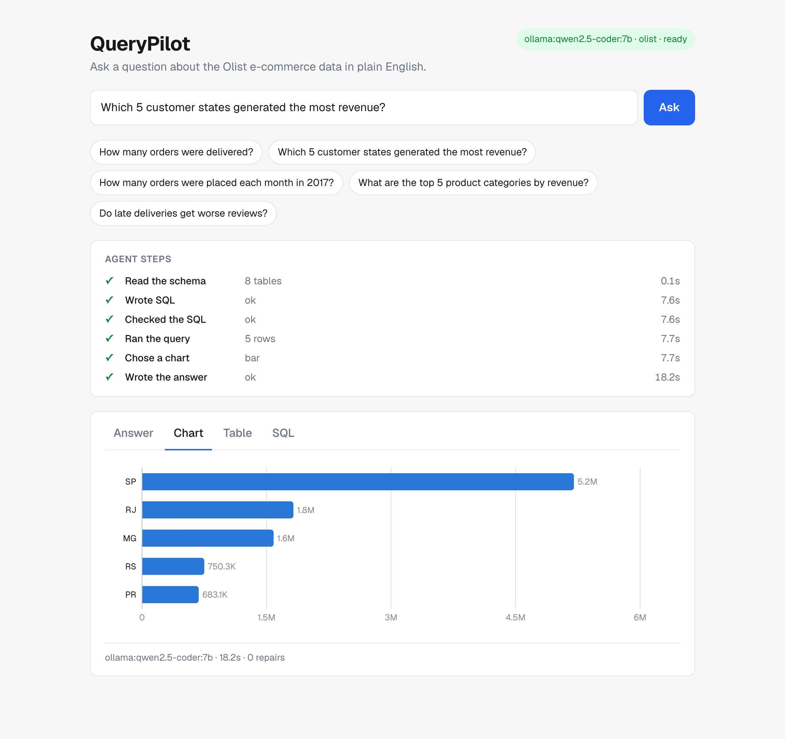
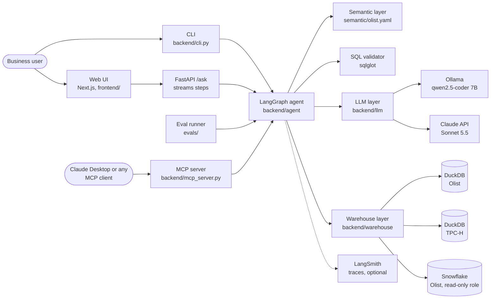
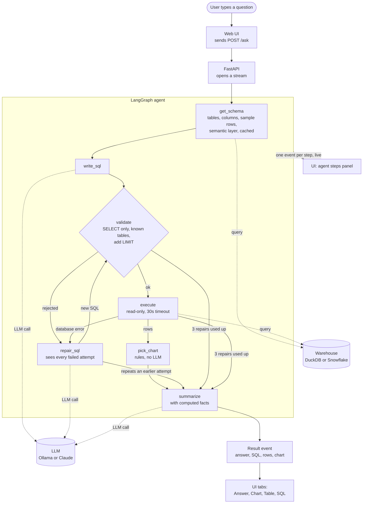
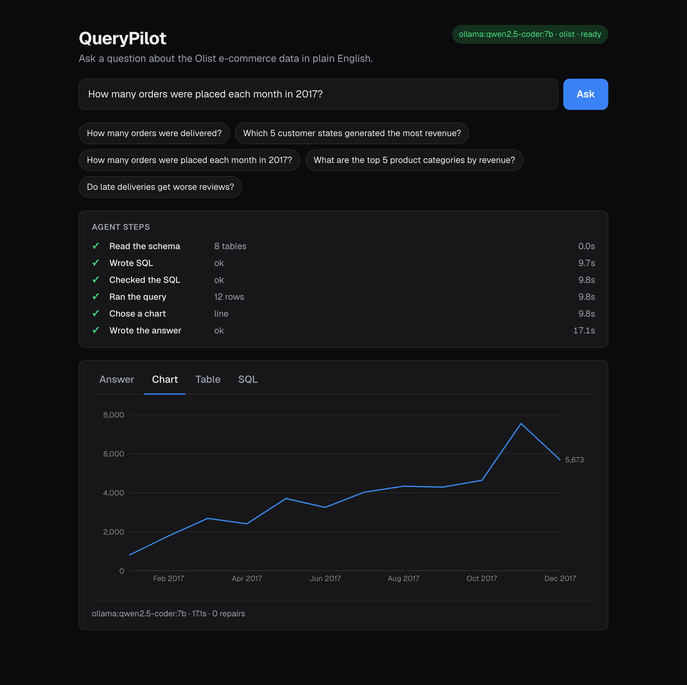
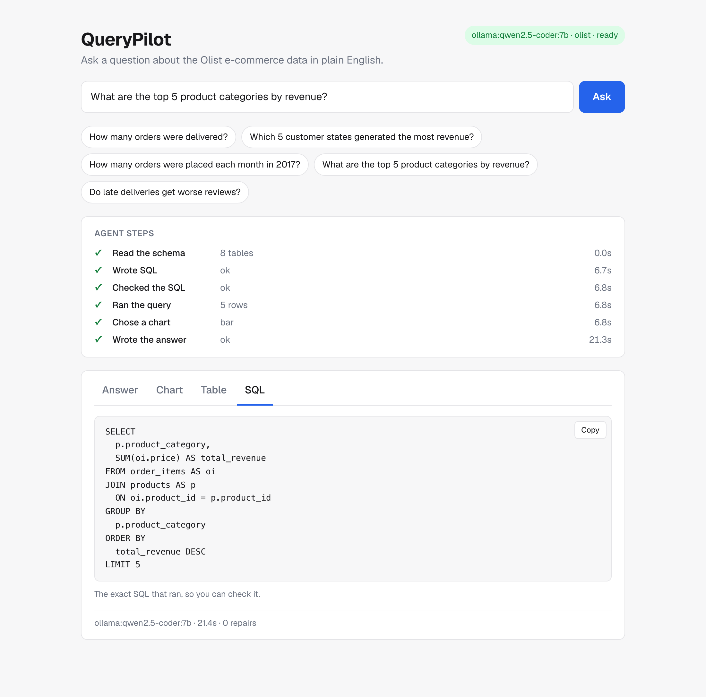

# QueryPilot: Agentic Text-to-SQL Analytics

Ask a business question in plain English. QueryPilot finds the right tables,
writes SQL, checks it against seven guardrails, runs it read-only, repairs its
own errors, and explains the answer, always showing the SQL it ran.

<!-- Demo GIF: record it with docs/demo-script.md, save as docs/images/demo.gif,
     then replace the screenshot below with  -->



> **Status:** the agent, guardrails, semantic layer, evals, streaming API, and
> web UI run on local DuckDB or on Snowflake, an MCP server makes the agent
> available to Claude Desktop, and `make up` runs the whole app in Docker.

## Results

Execution accuracy on 40 hand-written questions about a real e-commerce
dataset ([Olist](https://www.kaggle.com/datasets/olistbr/brazilian-ecommerce)),
before and after adding the semantic layer and the other fixes.

| | qwen2.5-coder 7B (local) before | qwen2.5-coder 7B (local) after | Claude Sonnet 5.5 before | Claude Sonnet 5.5 after |
|---|---|---|---|---|
| **Accuracy** | 14/40 (35%) | **29/40 (72%)** | 35/40 (88%) | **40/40 (100%)** |
| Easy (12) | 10 | 12 | 12 | 12 |
| Medium (16) | 3 | 13 | 14 | 16 |
| Hard (12) | 1 | 4 | 9 | 12 |
| Gave up honestly | 4 | 3 | 0 | 0 |
| Avg latency | 43s | 18s | 3.9s | 3.6s |
| Cost per question | free | free | $0.011 | $0.017 |

- **The semantic layer more than doubled the local model's accuracy** (35% to
  72%) and took Claude from 88% to 100%.
- **Cloud vs local:** Claude is 5 to 10x faster and gets every question
  right for under 2 cents each (about $17 per 1,000 questions). The local
  model is free and keeps data on the machine, but tops out around 72%.
- **Same answers on Snowflake:** the final agent scores 40/40 with Claude and
  30/40 with the local model on Snowflake (vs 40/40 and 29/40 on DuckDB), with
  all 40 gold queries checked to return identical results on both warehouses.
- **Honest caveats:** local latency varied 2x between identical runs because of
  laptop load. With a 7B model, any prompt change moves a few answers both
  ways, so differences of one question between runs are noise. At 40/40 the
  eval no longer separates strong models; a harder question set is the next step.

The full change-by-change history, including what did not help, is in
[`evals/CHANGELOG.md`](evals/CHANGELOG.md).

## How it works

### System design



Two small interfaces keep the agent independent of its providers. Every agent
step calls one `LLM.complete()` method and one `Warehouse.run_query()` method.
Switching from Ollama to Claude, or between datasets, is a `.env` setting,
not a code change, which is also what makes a fair side-by-side eval possible.

**Why DuckDB and Snowflake.** DuckDB is an analytical database that runs
inside the Python process: no server, no account, the whole database is one
file. That makes it free and instant for development and for running the
40-question eval dozens of times. Snowflake is the cloud warehouse a real
deployment would use. Both speak nearly the same SQL, so the same agent runs
on either with one setting, and all 40 gold queries return identical results
on both.

### What happens when you ask a question



The question enters through the web UI (or the CLI), and the API runs the
agent, streaming one event per step so the UI shows progress live. Dotted
lines show the only two outside systems the agent touches: the LLM (three
steps call it) and the warehouse (schema and query). Each box inside the
agent is one function in `backend/agent/nodes.py`; `backend/agent/graph.py`
wires them together. The state passed between steps holds the question, the
schema context, the SQL, every failed attempt and its error, the result rows,
and the answer. `pick_chart` uses plain rules on the result's shape (one
number, values over time, values per category), not an LLM call, so it is
free and instant. A `classify` step (reject questions the data can't answer)
is planned.

### The web UI

The browser reads the `/ask` stream as it arrives, so each agent step appears
the moment it finishes. The result opens in four tabs: Answer, Chart, Table,
and SQL. Charts are chosen by rules on the result's shape and drawn with
Recharts in colors checked for color-blind readers, in light and dark mode.

| Line chart, dark mode | The exact SQL that ran |
|---|---|
|  |  |

## Why semantics matter

The raw schema says *what columns exist*. It cannot say what the business
*means* by "customer" or "revenue". Three examples from the eval:

**1. Revenue: a broken formula.** *"What are the top 5 product categories by revenue?"*

| | SQL | Top result |
|---|---|---|
| Before (qwen 7B) | `SUM(price * freight_value)`, grouped by Portuguese category name | beleza_saude: 36,689,303 |
| After | `SUM(price)`, grouped by English category | health_beauty: 1,258,681 ✅ |

Item price multiplied by shipping cost is meaningless. One line in the
semantic layer, "revenue is `SUM(order_items.price)`; never multiply price by
freight", fixed this in every revenue question.

**2. Customers: the wrong ID.** *"Which 5 states have the most customers?"*

| | SQL | São Paulo |
|---|---|---|
| Before (qwen 7B) | `COUNT(customer_id)` | 41,746 |
| After | `COUNT(DISTINCT customer_unique_id)` | 40,302 ✅ |

In this dataset a new `customer_id` is created for every order, so counting
it counts orders, not people. Nothing in the column name says so. The
semantic layer does.

**3. A strong model, a different definition.** *"By what percentage did revenue grow in Q1 2018 compared with Q1 2017?"*

| | Revenue definition Claude chose | Answer |
|---|---|---|
| Before (Claude Sonnet 5.5) | Item price **plus freight**, canceled and unavailable orders excluded | 282.22% |
| After | Item price only, per the business definition | 274.34% ✅ |

Claude's first answer was reasonable, and it stated its assumptions. It just
wasn't the company's definition. Four of Claude's five failures without the
semantic layer were exactly this. **For a weak model the semantic layer fixes
broken logic; for a strong model it makes the answer match how the finance
team counts.**

All eight showcase questions, with SQL and answers before and after every
fix, are in [`evals/showcase.md`](evals/showcase.md).

## Guardrails

Seven layers between the LLM and the database:

| # | Guardrail | How |
|---|---|---|
| 1 | Read-only access | The database connection is opened read-only, so even a write that slipped past the validator would be refused. |
| 2 | One SELECT only | sqlglot parses the SQL into a syntax tree and rejects INSERT, UPDATE, DELETE, DROP, CREATE, and multiple statements. Parsing, not regex, so comments and odd casing can't sneak through. |
| 3 | Table allowlist | Only real tables are allowed; table functions like `read_csv('/etc/passwd')` are blocked. |
| 4 | Row limit | `LIMIT 1000` is added if missing. If a result hits the limit, the answer says it is partial (added by code, not left to the LLM). |
| 5 | Query timeout | Any query running over 30 seconds is cancelled and sent back for repair. |
| 6 | Admit failure | After 3 failed repairs, or if a repair repeats an earlier attempt, the agent says it could not answer instead of guessing. |
| 7 | Show the SQL | Every answer comes with the exact SQL that ran, so users can verify it. |

## Evals

- **Gold set:** 40 questions in [`evals/gold.yaml`](evals/gold.yaml), 12 easy,
  16 medium, 12 hard, each with a hand-written gold SQL query. Every question
  is tagged with the trap it tests: customer ID vs person, orders vs payment
  rows, revenue definition, late delivery, group comparisons, date math, and
  joins that duplicate rows.
- **Scoring:** the agent's SQL and the gold SQL are both run, and the result
  sets compared. Strict on numbers (rounded to 2 decimals, same row count),
  lenient on format (row order, column names, extra columns, and date formats
  don't matter). Scorer rules are unit tested.
- **Process:** baseline first, then one fix at a time with a full re-run after
  each, every failure checked by hand against gold, results logged in the
  CHANGELOG. Baseline results are frozen and never overwritten.
- **Metrics:** accuracy overall, by difficulty, and by trap; latency; tokens;
  cost per question; repair attempts.

What the process caught along the way:
- Ollama's default 4,096-token context **silently dropped half the prompt**,
  including the business definitions, with no error.
- A business definition written too strictly was **followed literally** and
  turned a right answer wrong.
- Few-shot examples helped where the pattern matched, but the model also
  **copied one example's structure** and answered a year-over-year question
  as quarter-over-quarter.
- A fix that looked like a +1 was really the effect of rewording an ambiguous
  question, confirmed by re-running the old code on the new question.

## Run it yourself

Requires Python 3.11+ and [Ollama](https://ollama.com) (or a Claude API key).

```bash
# 1. Install dependencies
pip install -r requirements.txt

# 2. Pull the local model
ollama pull qwen2.5-coder:7b

# 3. Create your config (defaults: Ollama + DuckDB + Olist)
cp .env.example .env

# 4. Download Olist from Kaggle (link below), unzip the 9 CSVs into data/olist/, then:
make data-olist

# 5. Optional: the TPC-H sample database, used only by the unit tests
make data
```

[Olist](https://www.kaggle.com/datasets/olistbr/brazilian-ecommerce) is about
100k real orders from a Brazilian marketplace (2016 to 2018). The load script
gives tables short names, stores dates as timestamps, joins English category
names into `products`, and reduces geolocation to one row per zip prefix so
joins don't multiply rows.

### Optional: Snowflake

The same Olist tables can live in Snowflake; set `WAREHOUSE=snowflake` and
the CLI, API, UI, and evals use it instead of DuckDB.

1. Create a [Snowflake trial](https://signup.snowflake.com) account.
2. Run `snowflake/setup.sql` as ACCOUNTADMIN in a Snowsight worksheet. It
   creates an X-Small warehouse (60s auto-suspend, 30s statement timeout), a
   5-credit monthly resource monitor, a read-only role, and a SERVICE user for
   the agent that signs in with an RSA key pair, not a password.
3. Run `snowflake/loader_user.sql` (a separate, short-lived loader user),
   then `make data-snowflake`. It loads every table and checks each row count
   against DuckDB. Disable the loader afterwards.
4. Fill in `SNOWFLAKE_ACCOUNT` in `.env`, set `WAREHOUSE=snowflake`.

Key pairs live in `.secrets/` (gitignored). Read-only access and the query
timeout are enforced by Snowflake itself, in addition to the SQL validator.
The semantic layer is written once in DuckDB SQL; worked examples are
translated to Snowflake SQL with sqlglot, and a definition can carry a
Snowflake-specific version where the spelling differs.

### Run everything with Docker

With Docker Desktop running and the data built (step 4 above):

```bash
make up      # builds and starts the API and the UI: http://localhost:3000
make down    # stops them
```

`docker-compose.yml` runs two containers: `api` (FastAPI + agent, port 8000)
and `ui` (the Next.js production build, port 3000). The local model is not
containerized: Ollama keeps running on the Mac, where it can use the GPU, and
the API container reaches it at `host.docker.internal`. The DuckDB files and
the Snowflake key pair are mounted read-only; `.env` and keys are never baked
into an image.

With the local model, answers are slower in Docker than natively (about 50s
instead of 20s on a MacBook Air), because Docker Desktop's virtual machine
takes memory the model would otherwise use. With `LLM_PROVIDER=anthropic`
answers take a few seconds either way.

### Choosing the LLM

| Setting | Ollama (local, free) | Claude (Anthropic API) |
|---|---|---|
| `LLM_PROVIDER` | `ollama` | `anthropic` |
| Model | `OLLAMA_MODEL=qwen2.5-coder:7b` | `ANTHROPIC_MODEL=claude-sonnet-5-5` |
| Other | `OLLAMA_NUM_CTX=16384`, `OLLAMA_KEEP_ALIVE=30m` | `ANTHROPIC_API_KEY=<your key>`, `ANTHROPIC_EFFORT=medium` |

Keep `OLLAMA_NUM_CTX`: without it, Ollama truncates the roughly 5,000-token
Olist prompt and the model never sees the business definitions.
`OLLAMA_KEEP_ALIVE` keeps the model loaded between questions (Ollama unloads
it after 5 idle minutes by default, and reloading costs about a minute); it
holds roughly 5 GB of memory while loaded.

### Tracing with LangSmith (optional)

Every run can be traced in [LangSmith](https://smith.langchain.com): each
graph step in order, every LLM call with its prompt, reply, and token counts,
and each routing decision. Eval runs are labelled by question id,
difficulty, and model, so a failed eval question can be opened and inspected
step by step.

```bash
LANGSMITH_TRACING=true
LANGSMITH_API_KEY=<your key>
LANGSMITH_PROJECT=querypilot
```

Tracing sends prompts, SQL, and sample rows to LangSmith's servers, so it is
off by default. Tests never send traces.

### Ask a question

```bash
python -m backend.cli "How many orders were delivered?"
```

The CLI prints each step as it runs, then the SQL, the result table, and the
answer:

```text
$ python -m backend.cli "Which 5 customer states generated the most revenue?"
[  0.2s] get_schema 8 tables
[  7.8s] write_sql  ok
[  7.8s] validate   ok
[  7.9s] execute    5 rows
[  7.9s] pick_chart bar
[ 18.8s] summarize  ok

Result:
customer_state | total_revenue
---------------+--------------
SP             | 5,202,955.05
RJ             | 1,824,092.67
...
```

### Run the API

```bash
make api    # http://localhost:8000, interactive docs at /docs
```

| Endpoint | What it does |
|---|---|
| `POST /ask` | Body `{"question": "..."}`. Streams Server-Sent Events: one `step` event per graph step as it finishes, then a `result` event with the answer, SQL, columns, rows, and chart spec. |
| `GET /examples` | Example questions for the UI. |
| `GET /health` | Model and dataset in use. |

```bash
curl -N -X POST localhost:8000/ask -H 'Content-Type: application/json' \
  -d '{"question": "How many orders were placed each month in 2017?"}'
```

### Run the web UI

Requires Node.js 20+. Start the API first, then in a second terminal:

```bash
cd frontend && npm install && cd ..   # first time only
make ui                               # http://localhost:3000
```

Type a question or click an example. The agent's steps appear as they
happen, then the result in four tabs:

- **Answer:** the plain-English answer, with a reminder to check its numbers.
- **Chart:** a bar, line, or single-number view, chosen by `pick_chart`.
  Colors come from a palette validated for color-blind readers in both light
  and dark mode.
- **Table:** every row, numbers formatted and right-aligned, with a note when
  the result was cut off at the 1,000-row limit.
- **SQL:** the exact query that ran, with a copy button.

The status badge shows the model, the dataset, and whether the local model
has finished warming up.

### Use it from Claude Desktop (MCP)

`backend/mcp_server.py` exposes QueryPilot as four read-only tools that any
MCP client can call:

| Tool | What it does |
|---|---|
| `ask` | The full agent: business question in, answer plus the SQL that ran out. Applies the semantic layer's definitions. |
| `list_tables` | Tables with a one-line business description |
| `describe_table` | Columns, types, business notes, and sample rows |
| `run_query` | One read-only SELECT, behind the same guardrails as the agent |

`run_query` lets the calling assistant write its own SQL, which skips the
semantic layer (for example, revenue excludes freight). The tool
descriptions steer business questions to `ask` for that reason.

To connect Claude Desktop, add this to
`~/Library/Application Support/Claude/claude_desktop_config.json` (use your
own paths) and restart Claude Desktop:

```json
{
  "mcpServers": {
    "querypilot": {
      "command": "/path/to/conda/envs/warehouse-agent/bin/python",
      "args": ["/path/to/warehouse-agent/backend/mcp_server.py"],
      "env": { "PYTHONPATH": "/path/to/warehouse-agent" }
    }
  }
}
```

The model and warehouse come from `.env`, as everywhere else. With the local
model, the server warms it up in the background when the client starts it.

### Run the evals and tests

```bash
make eval                                   # all 40 questions (needs make data-olist)
python -m evals.run_evals --ids e01,m03     # a few questions
python -m evals.rescore evals/results/<run> # re-score a saved run, no LLM calls
make test                                   # unit tests
```

Results are saved to `evals/results/<date>_<model>/`.
